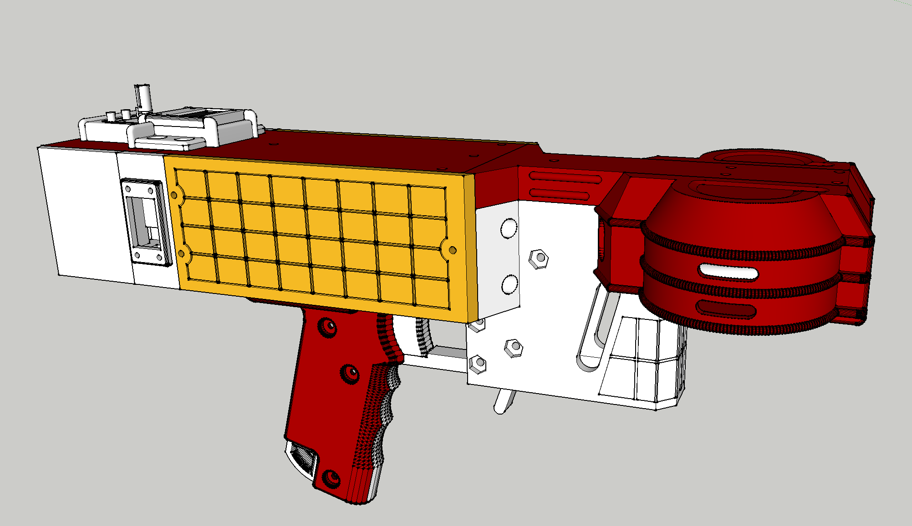

# "Governor" G4

This is a repo for a low-cost and feature-rich "flywheel-type" nerf blaster.

Features/Speficications:
- Goal build cost < 150$
- Minimal plastic-anchored screws *(almost evertthing is secured with bolts + captive nuts)*
- Brushless motor flyhweels
- Solenoid pusher
- LCD display
- Angled talon compatability *(straight stick support planned)*
- Integrated ammo counter hardware
- Integrated chronograph hardware
- 3-5S Lipo compatable
- 6cm flywheel diameter
- ESP32 controller
- Closed-loop flywheel control (providing fixed RPM and fast spinup times)
- Through-hole electronics and soldering
- Fast decay solenoid driver

Many of these features are implemented in the G4's companion firmware, [Detty](https://github.com/DrGlaucous/DettyFW).

